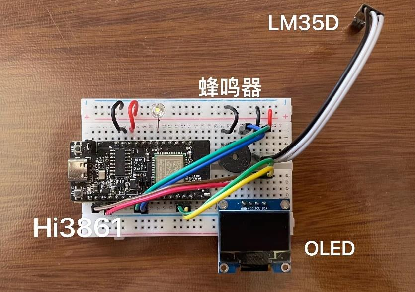
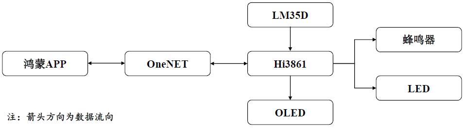
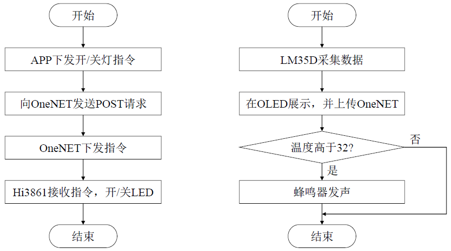

## 介绍

本项目基于OneNET平台，在Hi3861开发板上实现以下功能：

	1. 利用板载LED显示工作状态。当开发板正常工作时，板载LED闪烁。
	1. 利用LM35D温度传感器与板载ADC功能获取环境温度，在串口与OLED屏幕上显示，并上传至OneNET平台。
	1. 设定温度阈值，当环境温度高于阈值时，蜂鸣器发声。
	1. 在鸿蒙APP端，实时显示环境温度值，并控制开发板点亮LED

本项目包含硬件端（Hi3861）代码与软件端（HarmonyOS）代码

演示视频：[Demo](https://www.bilibili.com/video/BV1u3411G7hq)

Hi3861开发板主要负责控制蜂鸣器、LED、OLED的工作，收集LM35D采集的温度数据，并将其上传至OneNET平台。OneNET平台主要负责接收开发板上传的数据流，并利用API对数据流进行展示、对Hi3861下发命令。在鸿蒙APP端，向OneNET发送GET请求获取数据流，并展示在手机中；用户执行开关LED的命令时，APP端向OneNET发送POST请求，让后者下发命令，控制开发板点亮或熄灭LED。

## 如何使用

1. app文件夹替换applications/sample/wifi-iot/app文件夹。
2. onenet文件夹和pahomqtt文件夹放在//third_party下。
2. MyOnenet是对应的HarmonyOS APP代码。
2. 所有代码需要填Api-key、devideID、wifi账号密码的地方需要修改为自己的。

## 注意

1. 本代码基本参照[润和满天星系列开发资料](https://gitee.com/hihope_iot/HiHope_Pegasus_Doc?_from=gitee_search)撰写，部分长期未维护代码已重构或重写。
2. 完成时间比较仓促，代码不规范及错误地方请指出，欢迎讨论。
3. 代码编译所需的config.json、user_config.mk等文件需要自行修改。